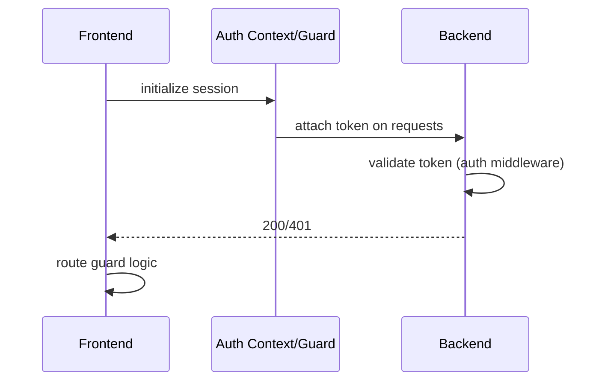

## Auth Flow

```mermaid
sequenceDiagram
  participant FE as Frontend
  participant AUTH as Auth Context/Guard
  participant API as Backend

  FE->>AUTH: initialize session
  AUTH->>API: attach token on requests
  API->>API: validate token (auth middleware)
  API-->>FE: 200/401
  FE->>FE: route guard logic
```

