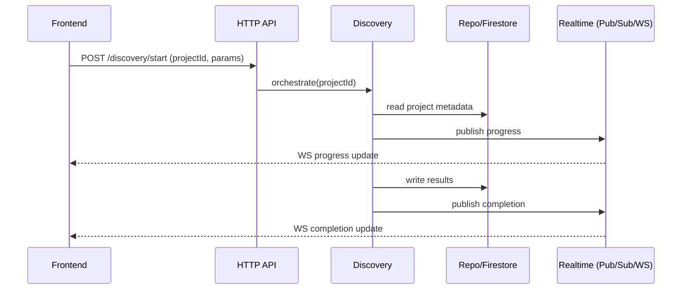

## Discovery Flow

```mermaid
sequenceDiagram
  participant UI as Frontend
  participant HTTP as HTTP API
  participant DISC as Discovery
  participant REPO as Repo/Firestore
  participant RT as Realtime (Pub/Sub/WS)

  UI->>HTTP: POST /discovery/start (projectId, params)
  HTTP->>DISC: orchestrate(projectId)
  DISC->>REPO: read project metadata
  DISC->>RT: publish progress
  RT-->>UI: WS progress update
  DISC->>REPO: write results
  DISC->>RT: publish completion
  RT-->>UI: WS completion update
```

