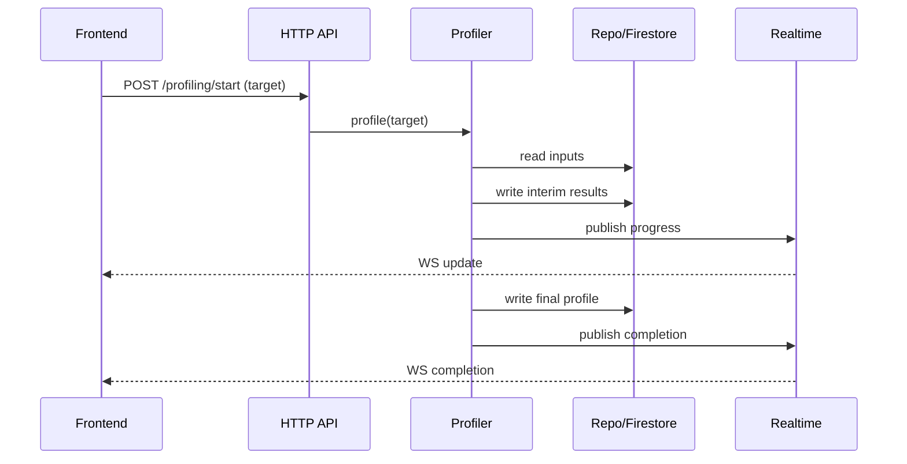

## Profiling Flow

```mermaid
sequenceDiagram
  participant UI as Frontend
  participant HTTP as HTTP API
  participant PROF as Profiler
  participant REPO as Repo/Firestore
  participant RT as Realtime

  UI->>HTTP: POST /profiling/start (target)
  HTTP->>PROF: profile(target)
  PROF->>REPO: read inputs
  PROF->>REPO: write interim results
  PROF->>RT: publish progress
  RT-->>UI: WS update
  PROF->>REPO: write final profile
  PROF->>RT: publish completion
  RT-->>UI: WS completion
```

