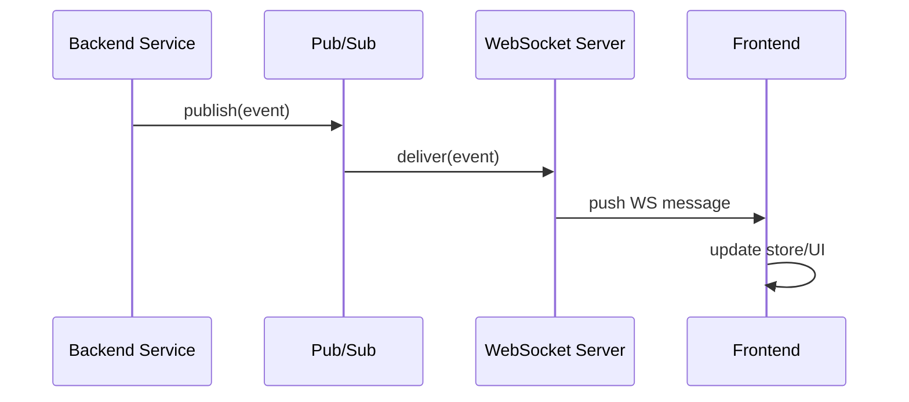

## Realtime Updates

```mermaid
sequenceDiagram
  participant SVC as Backend Service
  participant PS as Pub/Sub
  participant WS as WebSocket Server
  participant FE as Frontend

  SVC->>PS: publish(event)
  PS->>WS: deliver(event)
  WS->>FE: push WS message
  FE->>FE: update store/UI
```

